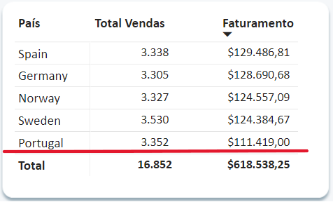
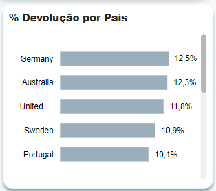
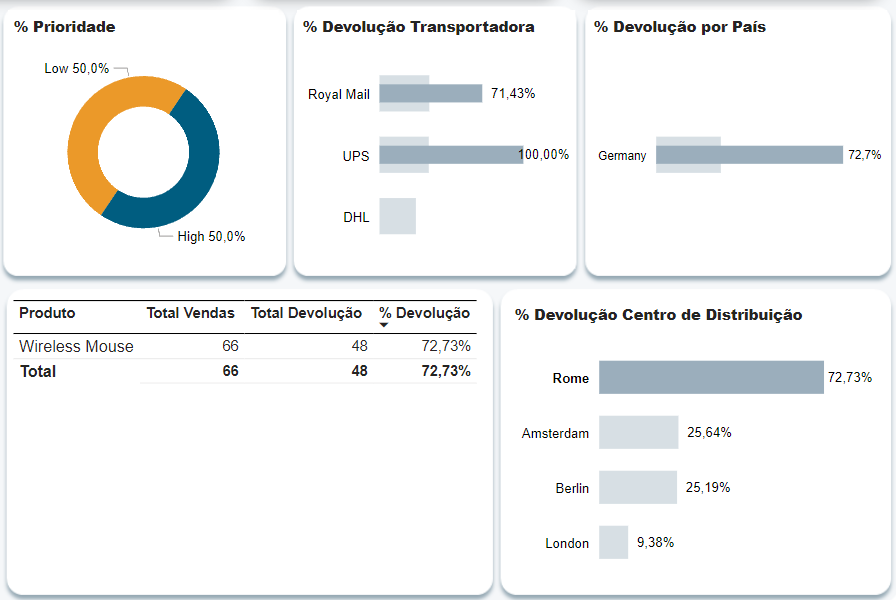

# sales
Dashboard de Vendas

## Descrição
Fiz esse relatório no Power BI para treinar.
A base de dados foi baixado no Kaggle. Link: https://www.kaggle.com/datasets/yusufdelikkaya/online-sales-dataset?resource=download

### Tratamento no Python
Antes de Iniciar no relatório no Power BI, tratei a base de dados no Python. 
1. Exclusão de Outliers.
2. Exclusão de datas futuras. (Conforme a época que foi feito)
3. Exclusão de dados faltantes.
4. Produtos classificado em categorias erradas.

### Breve análise do relatório

### - Visão Geral

Ao analisar a categoria de Acessórios, observa-se que a loja de Portugal possui o maior faturamento até o momento, mas isso se deve ao fato de ela ter realizado um número maior de vendas em comparação às lojas da Alemanha e da Espanha. Surge a dúvida: será que algum custo na operação da loja de Portugal é mais elevado? Ou será que as lojas da Alemanha e da Espanha adotam práticas diferentes que impactam positivamente sua eficiência?

Outra possível explicação pode estar no desconto oferecido pela loja de Portugal, que parece ser maior. Isso é sugerido pelo fato de que, embora a loja online de Portugal seja uma das que mais vende, ela apresenta o quarto pior faturamento da categoria no ambiente online.

 

### - Devoluções

A categoria de Eletrônicos apresenta o maior número de devoluções. A loja da Alemanha possui o maior percentual, e o mouse wireless é o item mais devolvido, tanto na loja física quanto na loja online.

 

Na análise das devoluções das lojas online, constata-se que 92% delas estão associadas a pedidos com prioridade de entrega classificada como "Low". Isso sugere que a demora na entrega leva os consumidores a desistirem da compra. Além disso, 72% das devoluções se originam no centro de distribuição de Roma, e a transportadora UPS teve 100% de suas entregas devolvidas. Esses dados indicam que pode haver problemas operacionais no centro de distribuição ou falhas na execução das entregas pela transportadora.

Na loja física, apesar de o percentual de devoluções ser ligeiramente menor em comparação às lojas online, a quantidade total de devoluções é maior. Como solucionar essa questão? Pode ser que os produtos não apresentem uma qualidade satisfatória ou que informações incorretas estejam sendo passadas pelos vendedores. Seria interessante realizar uma análise mais aprofundada desses dois cenários.

![devol].(online.png)

