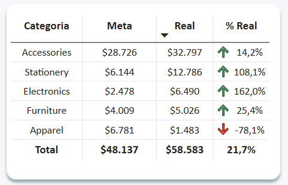
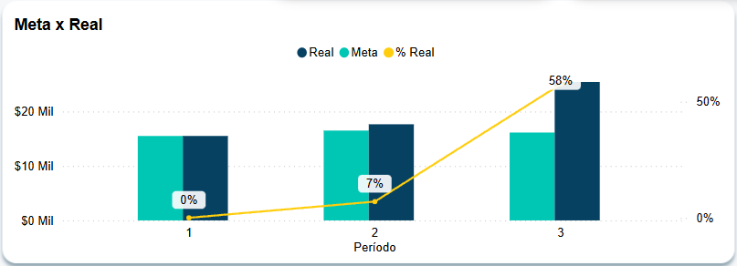

# sales
Dashboard de Vendas feito no Power BI.

## Descrição
A base de dados foi baixada no Kaggle. 
- Link Power BI online: https://bit.ly/3PDCcRR 
- Link: https://www.kaggle.com/datasets/yusufdelikkaya/online-sales-dataset?resource=download

### Tratamento no Python
Antes de Iniciar no relatório no Power BI, tratei a base de dados no Python. 
1. Exclusão de Outliers.
2. Exclusão de datas futuras. (Conforme a época que foi feito)
3. Exclusão de dados faltantes.
4. Produtos classificado em categorias erradas.

### Análise de Meta x Real - Loja de Portugal (Agosto/2024)
Foi estabelecida uma meta de crescimento de 10% em relação ao ano anterior para a loja de Portugal. A análise foi realizada por períodos de 10 dias ao longo do mês.
OBS: No Power BI Online, 

#### 1° Período (01/08 a 10/08)
- Meta: $15.504

- Vendas Realizadas: $15.509 ✅ Meta atingida

A categoria "Apparel" apresentou um problema significativo: o produto T-shirt não teve nenhuma venda. Possíveis causas incluem problemas com fornecedores, falhas na exposição do produto (caso seja loja física) ou baixa demanda.

O produto Office Chair, da categoria "Furniture", também ficou abaixo da meta, mas apresentou altos descontos, sugerindo que pode ter sido vendido como complemento de outras compras.

Ação recomendada: Orientar a equipe para impulsionar as vendas desses produtos no próximo período.

#### 2° Período (11/08 a 20/08)
- Meta: $16.496

- Vendas Realizadas: $17.640 ✅ Meta superada em 7%

A categoria "Accessories" teve desempenho fraco, com vendas 32% abaixo da meta. Isso indica necessidade de análise mais detalhada sobre estoque, precificação ou concorrência.

Em contrapartida, "Furniture", que estava abaixo da meta no primeiro período, teve um crescimento expressivo e atingiu 207% da meta.

Acumulado até aqui: Vendas 3,6% acima da meta.

Ação recomendada: Investigar o baixo desempenho de "Accessories" e ajustar estratégias de venda.

#### 3° Período (21/08 a 31/08)
- Meta: $16.137

- Vendas Realizadas: $25.420 ✅ Meta superada em 57%

Meta atingida em todas as categorias, com exceção de "Apparel", que, apesar de apresentar melhora, ainda não alcançou o esperado. Isso pode indicar um problema sazonal, tornando necessário avaliar se é um produto viável para o período.

### Resultado final: 
- O faturamento acumulado do mês foi de $58.583, representando um crescimento de 21% acima da meta.

- Os 3 períodos atingiram as metas. O período de 21/08 a 31/08 vendeu bem acima do esperado, atingindo 57% da meta.
  

  
  
  
  
- Lista dos produtos vendidos no mês de agosto de 2024. Destaque para os produtos White Mug, Notebook e Backpack, que juntos venderam o equivalente a 49% das vendas totais.

  
  
  

### Conclusão e Próximos Passos
Apesar do bom desempenho geral, "Apparel" e "Accessories" foram as categorias mais críticas. Sugere-se um aprofundamento nas causas de baixo desempenho para evitar impactos futuros.

A estratégia de descontos pode estar influenciando os resultados de algumas categorias, e uma análise do impacto desses descontos sobre a margem de lucro seria relevante.

A loja de Portugal conseguiu um crescimento expressivo, mas algumas discrepâncias entre categorias indicam pontos de melhoria na gestão de estoque e promoção de produtos.

